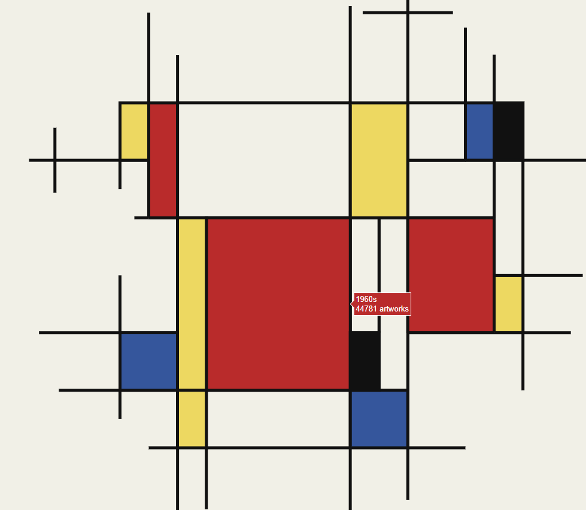
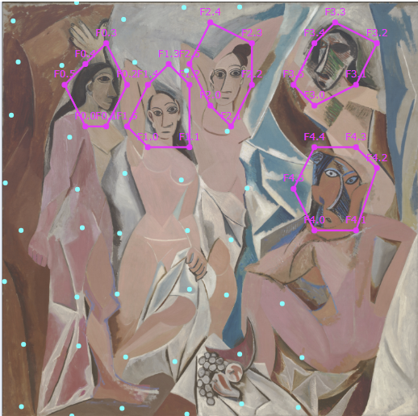

# MoMA Data Art

Data-driven visualizations built from each painting's own real geometry:
a painting's shapes are digitized from the reference image and become the
container for real MoMA collection data, revealed on hover. Mondrian spec:
`docs/superpowers/specs/2026-08-06-mondrian-real-geometry-redesign.md`.

Demoiselles d'Avignon redesign in progress — a Voronoi tessellation over
the painting's own canvas, faces excluded as decoration. Spec:
`docs/superpowers/specs/2026-08-06-demoiselles-voronoi-redesign.md`.

## Progress

- [x] Project scaffolding
- [x] Data pipeline (`src/data.py`, tested against the real dataset)
- [x] Mondrian chart (real-geometry redesign) — `charts.mondrian_treemap`, 22 tests passing
- [ ] Demoiselles / Dance I redesign — in progress, prototyping face contours and seed points
- [ ] Static site + GitHub Pages
- [ ] Scheduled data refresh

`notebooks/01_eda.ipynb` is ready — open it in Jupyter and run the cells to
review the real distributions (Medium_category, Region_list,
Decade_acquired) before building further chart functions.

## Next steps

- [ ] Redesign Demoiselles / Dance I with the same real-geometry technique
- [ ] `src/build_site.py` + GitHub Pages deployment
