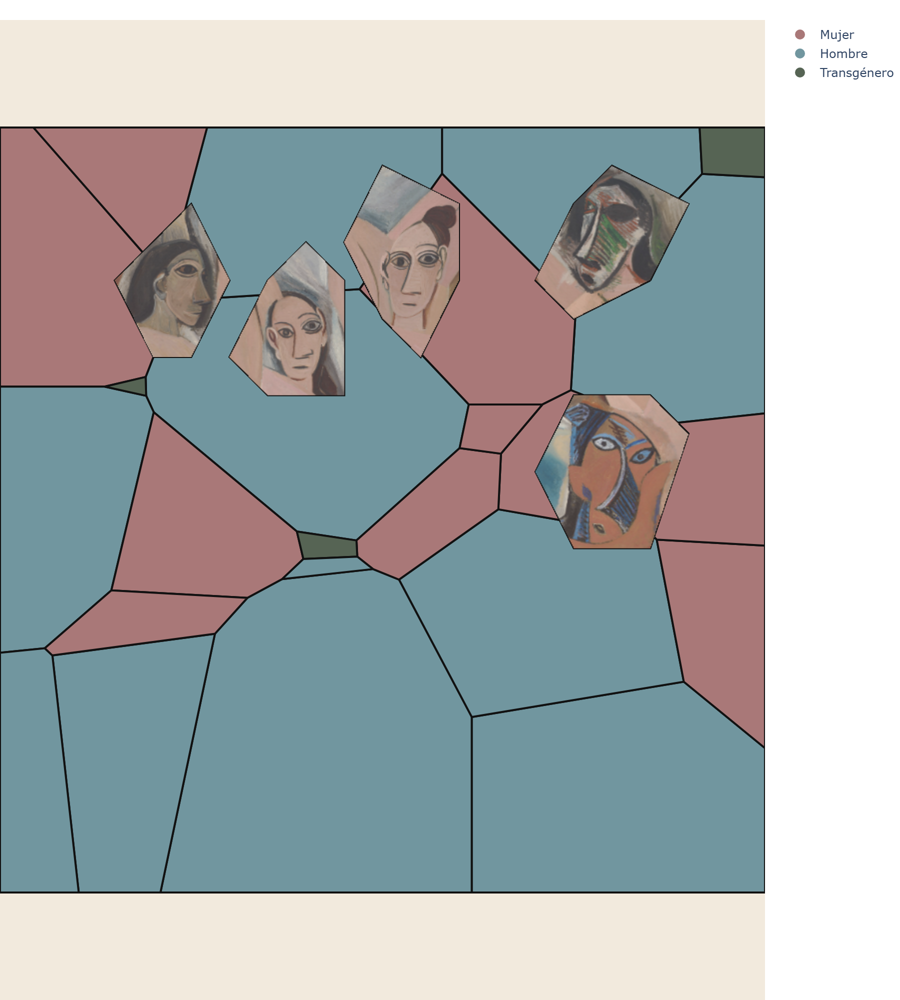

# MoMA Data Art

Data-driven visualizations built from each painting's own real geometry:
a painting's shapes are digitized from the reference image and become the
container for real MoMA collection data, revealed on hover. Mondrian spec:
`docs/superpowers/specs/2026-08-06-mondrian-real-geometry-redesign.md`.

Demoiselles d'Avignon: a weighted Voronoi tessellation over the painting's
own canvas, cell area fit to sqrt(each (decade, gender) category's
artwork count), anchored at hand-placed positions. The 5 faces show the
real painting pixels for that region, masked to their contour, instead of
a flat fill. Colors are sampled directly from the painting. Spec:
`docs/superpowers/specs/2026-08-06-demoiselles-voronoi-redesign.md`.

## Progress

- [x] Project scaffolding
- [x] Data pipeline (`src/data.py`, tested against the real dataset)
- [x] Mondrian chart (real-geometry redesign) — `charts.mondrian_treemap`, 22 tests passing
- [x] Demoiselles Voronoi chart (weighted-Voronoi redesign, hand-placed anchors, real face-image crops, painting-sampled colors) — `charts.demoiselles_voronoi`, graduated from `notebooks/04_demoiselles_prototyping.ipynb`, 44 tests passing project-wide
- [ ] Dance I redesign — not started
- [ ] Static site + GitHub Pages
- [ ] Scheduled data refresh

`notebooks/01_eda.ipynb` is ready — open it in Jupyter and run the cells to
review the real distributions (Medium_category, Region_list,
Decade_acquired) before building further chart functions.

## Next steps

- [ ] Redesign Dance I with the same real-geometry technique
- [ ] `src/build_site.py` + GitHub Pages deployment
